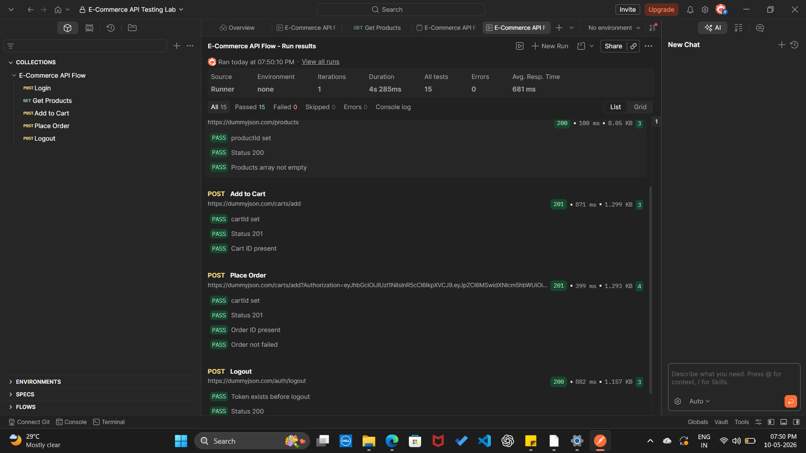

<h1 align="center">📮 Postman API Testing — E-Commerce</h1>
<p align="center">
  REST API test collection for a complete e-commerce flow
  with token authentication, request chaining & JavaScript assertions
</p>

---

## 🛠️ Tools Used


---

## 📌 What This Project Covers

- ✅ Login with Bearer token authentication
- ✅ Auto token save and reuse across all requests
- ✅ Chained requests using collection variables
- ✅ Pre-request validation scripts
- ✅ JavaScript assertions on responses

---

## 🔄 API Flow

| Step | Request | Action |
|---|---|---|
| 1 | Login | Bearer token auto saved to collection variable |
| 2 | Get Products | Product ID saved for next request |
| 3 | Add to Cart | Cart ID saved from response |
| 4 | Place Order | Order ID saved from response |
| 5 | Logout | Token cleared and verified |

---

## ✅ Assertions Covered

| Assertion | Description |
|---|---|
| Status Code | 200, 201 validation |
| Field Existence | token, cart ID, order ID checks |
| Data Type | string, number validation |
| Pre-request | Variable checks before each call |

---

## 📊 Test Results



---

## ▶️ How to Run

```bash
1. Import ecommerce-api-tests.json into Postman
2. Set baseUrl variable to your API base URL
3. Click Run Collection
4. Tests execute in order automatically
```

---

## 💡 What I Learned

- How to chain API requests using collection variables
- How to auto-save and reuse Bearer tokens
- Writing JavaScript assertions in Postman Tests tab
- Pre-request script validation techniques

---

## 👩‍💻 Author

**Vishnu Durga S**
🔗 [GitHub](https://github.com/VishnuDurgaCse)
📧 vishnudurgacs@gmail.com
